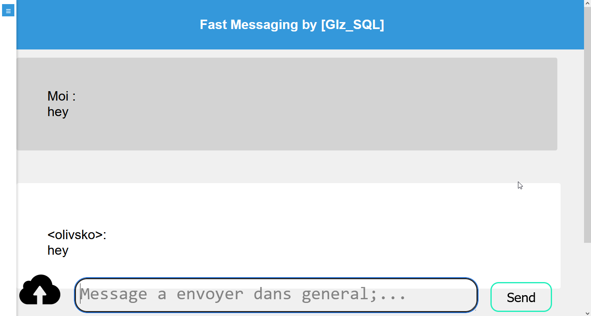

# Application de Messagerie Flask-SocketIO

Une application de messagerie simple construite en utilisant Flask et SocketIO.

## Description

Cette application permet aux utilisateurs de communiquer via des messages en temps réel au sein de différentes salles de discussion. Les utilisateurs peuvent se connecter, rejoindre des salles de chat, envoyer des messages et même partager des images.

## Capture d'Écran



## Table des matières

- [Installation](#installation)
- [Utilisation](#utilisation)
- [Fonctionnalités](#fonctionnalités)
- [Contributions](#contributions)
- [Licence](#licence)

## Installation

1. Clonez le dépôt :

   ```bash
   git clone <repository_url>
   cd <repository_directory>


2. Installez les packages requis en utilisant pip :

```bash
pip install -r requirements.txt
```

## Utilisation

1. Lancez l'application :
```bash
python3 main.py
```

2. Accédez à l'application dans votre navigateur web à http://localhost:80.

## Fonctionnalités
- Authentification Utilisateur : Les utilisateurs peuvent se connecter avec leur nom d'utilisateur et leur mot de passe.
- Messagerie en Temps Réel : Les utilisateurs peuvent envoyer et recevoir des messages en temps réel au sein des salles de chat.
- Partage d'Images : Les utilisateurs peuvent partager des images au sein du chat.
- Salles Multiples : Les utilisateurs peuvent rejoindre différentes salles de chat et passer de l'une à l'autre.
- Historique des Messages : Les messages précédents sont restaurés lors de la connexion à une salle de chat.
- Données Persistantes : Les informations utilisateur et les messages sont stockés dans une base de données SQLite.

## Contributions

Les contributions sont les bienvenues ! 

## Licence

Ce projet est sous licence MIT.