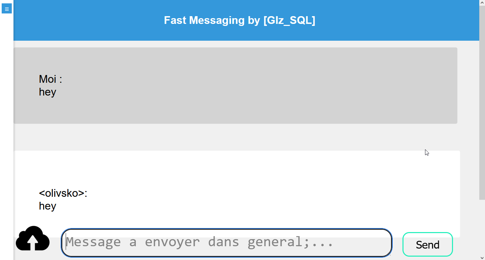

# Flask-SocketIO Messaging Application
<!-- # Flask-SocketIO-Messaging-Application -->

A simple messaging application built using Flask and SocketIO.

## Description

This application allows users to communicate through real-time messages within different chat rooms. Users can log in, join chat rooms, send messages, and even share images.

## Screenshot



## Table of Contents

- [Installation](#installation)
- [Usage](#usage)
- [Features](#features)
- [Contributions](#contributions)
- [License](#license)

## Installation

1. Clone the repository:

   ```bash
   git clone <repository_url>
   cd <repository_directory>

2. Install the required packages using pip:
```bash
pip install -r requirements.txt
```

# Usage
1. Launch the application:
```bash
python3 main.py
```

2. Access the application in your web browser at `http://localhost:80`.

## Features
- User Authentication: Users can log in using their username and password.
- Real-time Messaging: Users can send and receive real-time messages within chat rooms.
- Image Sharing: Users can share images within the chat.
- Multiple Rooms: Users can join different chat rooms and switch between them.
- Message History: Previous messages are restored when joining a chat room.
- Persistent Data: User information and messages are stored in an SQLite database.
- Contributions
- Contributions are welcome!

## License
This project is under the MIT license.
